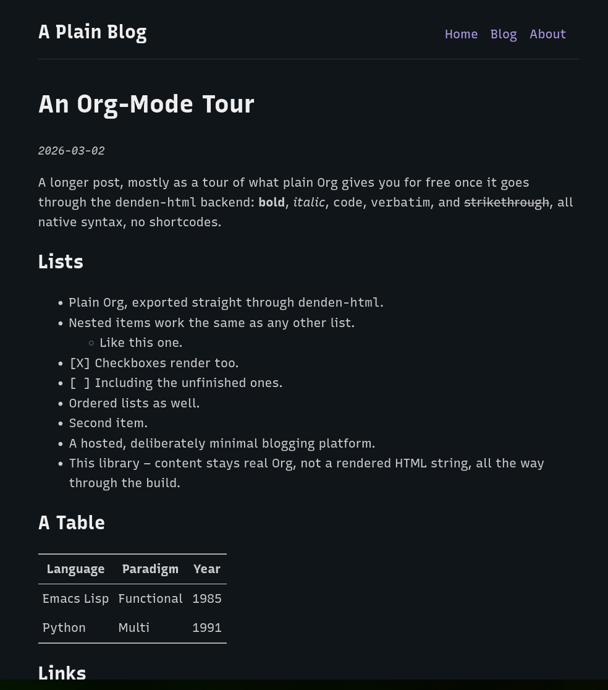

#+TITLE: denden example: a Bear-Blog-style site

The smallest real site denden.el can build: a home page, an about page,
a blog listing, and a few posts. One stylesheet, no JavaScript, no tags
or taxonomy pages. Inspired by
https://github.com/janraasch/hugo-bearblog/, not a port of it.

* Files

- =example-site.el= :: content/publishing directories, the org-publish
  project, page dispatch, and the build entry points. The contract
  =denden/README.org= describes, filled in for a real (if tiny) site.
- =example-theme.el= :: the sexp-HTML templates: page skeleton, single
  post, post list.
- =example-async-init.el= :: the child-process init file for
  =example-build-async=, same reasoning as =denden/denden-async-init.el=.
- =content/= :: the site's own content. =_index.org= is the home page,
  =about.org= a plain page, =blog/= the posts plus their own
  =_index.org= listing.
- =assets/style.css= :: the whole stylesheet.

* Building

From =denden/=: =just example-build= (or =just example-serve= to also
preview it). From Emacs, once =example-site.el= is loaded:
=M-x denden-build=, =denden-build-serve=, =denden-preview-current-file=,
and the rest of denden's own command surface all work as documented in
=denden/README.org=.
